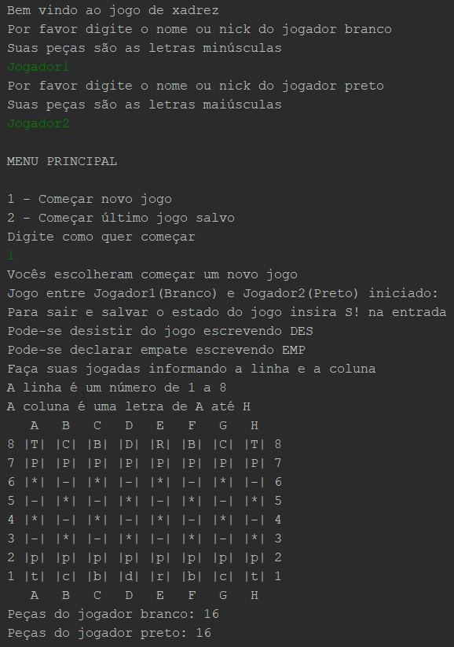

# Chess ♚

Project to recreate chess in the terminal using Java

The project let's two people simulate a chess game in the terminal, moreover there is a possiblity to save the game state and load it to play later.

---

## Example of use

